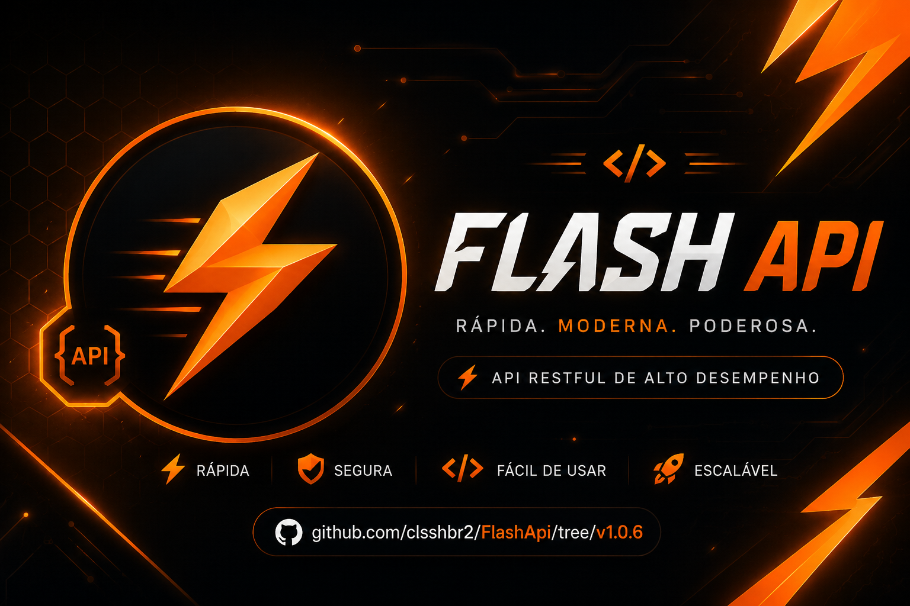
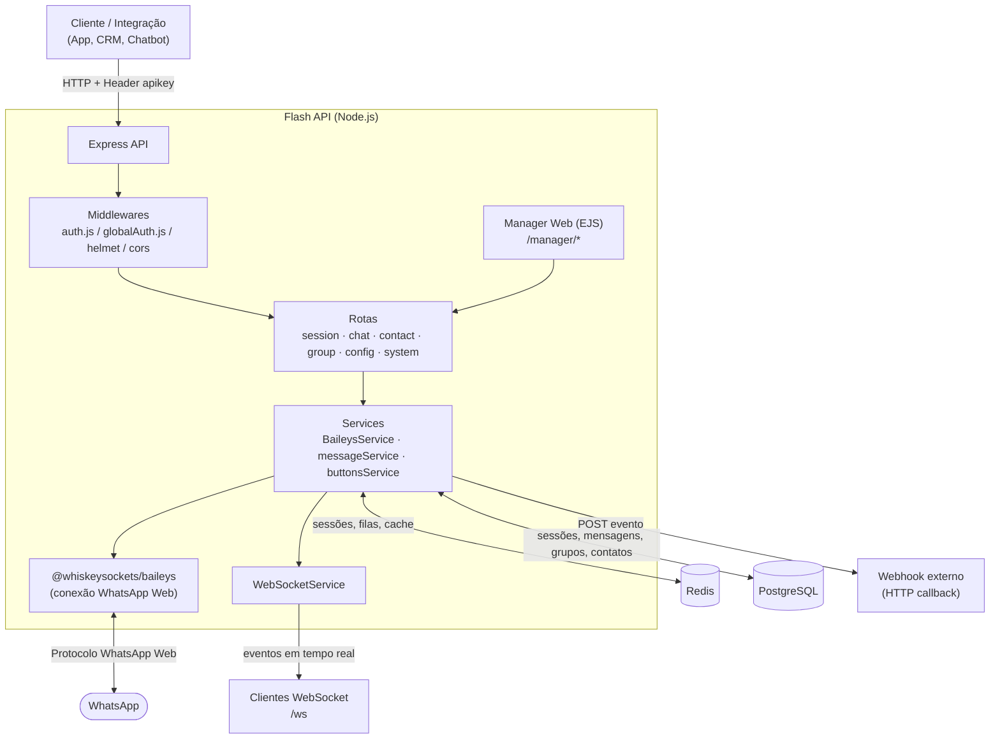
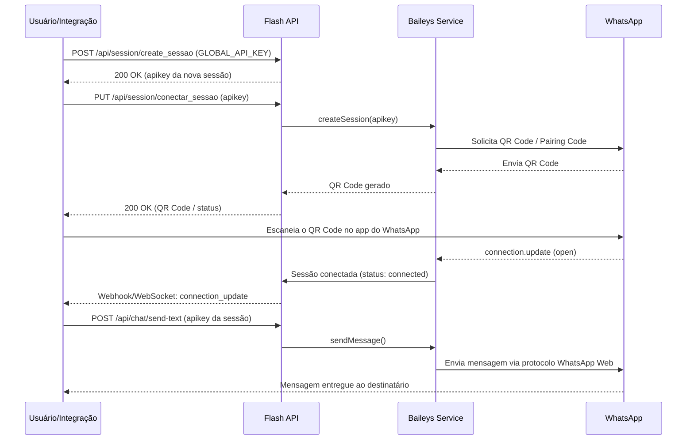

<div align="center">



# ⚡ Flash API

### API REST Multi-Sessão para WhatsApp, construída sobre o Baileys

Gerencie centenas de instâncias do WhatsApp de forma independente, com autenticação por API Key, Webhooks, WebSocket, painel administrativo e persistência em PostgreSQL + Redis.

<br>

[](https://nodejs.org/)
[](https://expressjs.com/)
[](https://github.com/WhiskeySockets/Baileys)
[](https://www.postgresql.org/)
[](https://redis.io/)
[](https://www.docker.com/)
[](#-licença)
[](https://github.com/clsshbr2/FlashApi/releases/tag/v1.0.6)

</div>

---

## 📚 Sumário

- [Sobre o Projeto](#-sobre-o-projeto)
- [Principais Recursos](#-principais-recursos)
- [Arquitetura](#-arquitetura)
- [Fluxo de Funcionamento](#-fluxo-de-funcionamento)
- [Estrutura de Pastas](#-estrutura-de-pastas)
- [Tecnologias e Dependências](#-tecnologias-e-dependências)
- [Pré-requisitos](#-pré-requisitos)
- [Instalação](#-instalação)
  - [Instalação Manual](#instalação-manual)
  - [Instalação com Docker](#instalação-com-docker)
- [Variáveis de Ambiente](#-variáveis-de-ambiente)
- [Scripts Disponíveis](#-scripts-disponíveis)
- [Como Executar](#-como-executar)
- [Painel Administrativo (Manager)](#-painel-administrativo-manager)
- [Referência da API](#-referência-da-api)
  - [Autenticação](#autenticação)
  - [Sessões](#sessões)
  - [Mensagens (Chat)](#mensagens-chat)
  - [Contatos](#contatos)
  - [Grupos](#grupos)
  - [Configurações](#configurações)
  - [Sistema](#sistema)
- [Exemplos de Uso](#-exemplos-de-uso)
- [Webhooks](#-webhooks)
- [WebSocket](#-websocket)
- [Coleção Postman](#-coleção-postman)
- [Limitações Conhecidas](#-limitações-conhecidas)
- [Roadmap](#-roadmap)
- [FAQ](#-faq)
- [Contribuindo](#-contribuindo)
- [Licença](#-licença)

---

## 🧭 Sobre o Projeto

**Flash API** é uma API RESTful escrita em **Node.js (ESM)** que expõe o protocolo do WhatsApp Web através da biblioteca [**Baileys**](https://github.com/WhiskeySockets/Baileys), permitindo criar e administrar **múltiplas sessões (instâncias) de WhatsApp** simultaneamente através de uma **API Key** exclusiva por sessão.

O projeto foi pensado para cenários de **multi-tenant/multi-atendimento**, oferecendo:

- Criação de sessões via QR Code ou pareamento por número de telefone;
- Persistência de credenciais e chaves da sessão em **PostgreSQL**;
- Fila e cache de alta performance com **Redis**;
- Notificações em tempo real via **Webhook HTTP** e/ou **WebSocket**;
- Um **painel web (Manager)** para acompanhar e administrar as sessões visualmente.

> ⚠️ Este projeto não é afiliado, endossado ou de qualquer forma oficialmente conectado ao WhatsApp Inc./Meta. Use com responsabilidade e em conformidade com os Termos de Serviço do WhatsApp.

---

## ✨ Principais Recursos

| Recurso                                    | Descrição                                                                                                                                                                                                      |
| ------------------------------------------ | -------------------------------------------------------------------------------------------------------------------------------------------------------------------------------------------------------------- |
| 🔀 **Multi-Sessão**                        | Crie e opere múltiplas instâncias do WhatsApp de forma isolada, cada uma com sua própria `apikey`.                                                                                                             |
| 🔑 **Autenticação em 2 níveis**            | `GLOBAL_API_KEY` para operações administrativas (criar/listar/remover sessões) e `apikey` por sessão para operações de mensageria.                                                                             |
| 📱 **Conexão via QR Code ou Pairing Code** | Suporte a conexão tradicional por QR Code ou por número de telefone.                                                                                                                                           |
| 💬 **Envio completo de mensagens**         | Texto, imagem, vídeo, áudio (convertido para Opus/OGG automaticamente via `ffmpeg`), documento, localização, contato, figurinha (sticker), reação, enquete, listas, botões, mensagens interativas e carrossel. |
| 👥 **Gestão de Grupos**                    | Criar, listar, atualizar participantes/descrição/assunto, configurar permissões e gerar/revogar links de convite.                                                                                              |
| 👤 **Gestão de Contatos**                  | Listagem, verificação de números no WhatsApp, bloqueio/desbloqueio e conversão de LID para JID.                                                                                                                |
| 🔔 **Webhooks configuráveis**              | Webhook global (via `.env`) ou por sessão, com lista de eventos customizável e tentativas de reenvio configuráveis.                                                                                            |
| 🔌 **WebSocket nativo**                    | Canal bidirecional (`/ws`) para consumo de eventos em tempo real sem long-polling.                                                                                                                             |
| 🗄️ **Persistência híbrida**                | PostgreSQL para dados estruturados (sessões, mensagens, contatos, grupos) e Redis para sessões, cache e filas de credenciais/chaves.                                                                           |
| 🖥️ **Painel Web (Manager)**                | Dashboard EJS com login de administrador/usuário para visualizar e operar sessões sem usar a API diretamente.                                                                                                  |
| 🌍 **Suporte a Proxy**                     | Roteamento de conexões por proxy HTTP/HTTPS/SOCKS4/SOCKS5 por sessão.                                                                                                                                          |
| 🧹 **Auto-limpeza de sessões**             | Remoção automática de sessões desconectadas após um tempo configurável.                                                                                                                                        |
| 🐳 **Docker-ready**                        | `Dockerfile` e `docker-compose.yml` prontos, orquestrando API + PostgreSQL + Redis.                                                                                                                            |
| 📬 **Coleção Postman**                     | `postman_collection.json` incluso, pronto para importar e testar todos os endpoints.                                                                                                                           |

---

## 🏗️ Arquitetura

A Flash API segue uma arquitetura em camadas (routes → services → models → banco de dados), com Redis atuando como camada de cache/sessão e barramento de filas entre a API e o worker que processa as credenciais do Baileys.



---

## 🔄 Fluxo de Funcionamento

Fluxo típico de criação e uso de uma sessão:



---

## 🗂️ Estrutura de Pastas

```text
FlashApi/
├── Dockerfile                  # Imagem Docker da API
├── docker-compose.yml          # Orquestração: API + PostgreSQL + Redis
├── gerardb.js                  # Inicializa/valida o banco de dados na subida do servidor
├── nodemon.json                # Configuração do hot-reload em desenvolvimento
├── package.json                # Dependências e scripts npm
├── postman_collection.json     # Coleção Postman com todos os endpoints
├── server.js                   # Ponto de entrada da aplicação (Express + WebSocket)
│
├── public/                     # Arquivos estáticos servidos pela API
│   ├── css/                    # Estilos do painel Manager
│   ├── images/                 # Imagens (banner, avatar padrão etc.)
│   └── js/                     # Scripts front-end do painel
│
├── views/                      # Views EJS do painel administrativo (Manager)
│   ├── index.ejs
│   ├── user.ejs
│   └── dashboard.ejs
│
├── supabase/
│   └── migrations/
│       └── postgres.sql        # Schema SQL de referência das tabelas
│
└── src/
    ├── config/
    │   ├── env.js               # Carrega e normaliza todas as variáveis de ambiente
    │   ├── database.js          # Conexão/execução de queries no banco
    │   └── verificardb.js       # Verificação/atualização incremental de colunas/tabelas
    │
    ├── middleware/
    │   ├── auth.js               # Autenticação por apikey de sessão
    │   └── globalAuth.js         # Autenticação por GLOBAL_API_KEY (rotas administrativas)
    │
    ├── models/
    │   ├── ApiKey.js
    │   ├── Session.js
    │   ├── Contatos.js
    │   ├── Grupos.js
    │   ├── Message.js
    │   ├── chats.js
    │   └── Store.js
    │
    ├── routes/
    │   ├── session.js            # Ciclo de vida das sessões (criar, conectar, status, deletar…)
    │   ├── chat.js                # Envio de mensagens e leitura de conversas
    │   ├── contact.js             # Contatos: listar, checar, bloquear
    │   ├── group.js               # Grupos: criar, administrar, convites
    │   ├── config.js              # Configurações da sessão (webhook, proxy, dados gerais)
    │   ├── system.js              # Status/monitoramento do sistema
    │   └── manager.js             # Login e dashboard do painel web
    │
    ├── services/
    │   ├── BaileysService.js       # Núcleo de integração com o Baileys (conexão, eventos, QR)
    │   ├── WebSocketService.js     # Broadcast de eventos via WebSocket
    │   ├── messageService.js       # Montagem/envio de mensagens (mídia, texto, localização…)
    │   ├── buttonsService.js       # Botões, listas, mensagens interativas e carrossel
    │   ├── redis.js                # Cliente Redis (ioredis)
    │   ├── usePostgresAuthStore.js # Auth store do Baileys persistido em PostgreSQL
    │   └── workers/                # Workers assíncronos (ex.: processamento de filas)
    │
    └── utils/
        ├── logger.js               # Logger (pino) com formatação amigável
        └── prepareMedia.js         # Normalização de mídia (URL, base64, buffer)
```

---

## 🧰 Tecnologias e Dependências

### Core

| Tecnologia                                                           | Uso                                           |
| -------------------------------------------------------------------- | --------------------------------------------- |
| [Node.js 20+](https://nodejs.org/)                                   | Runtime JavaScript (ESM — `"type": "module"`) |
| [Express 4](https://expressjs.com/)                                  | Framework HTTP/REST                           |
| [@whiskeysockets/baileys](https://github.com/WhiskeySockets/Baileys) | Cliente WhatsApp Web (multi-device)           |
| [ws](https://github.com/websockets/ws)                               | Servidor WebSocket nativo                     |
| [EJS](https://ejs.co/)                                               | Template engine do painel Manager             |
| [PostgreSQL](https://www.postgresql.org/) (`pg`)                     | Banco de dados relacional principal           |
| [Redis](https://redis.io/) (`ioredis`)                               | Cache, sessões e filas                        |

### Bibliotecas de apoio

| Categoria           | Pacotes                                                                                           |
| ------------------- | ------------------------------------------------------------------------------------------------- |
| Segurança           | `helmet`, `cors`, `bcrypt`, `jsonwebtoken`, `express-session`, `connect-redis`                    |
| Validação           | `joi`                                                                                             |
| Mídia               | `@ffmpeg-installer/ffmpeg`, `fluent-ffmpeg`*, `wa-sticker-formatter`, `qrcode`, `qrcode-terminal` |
| HTTP/Proxy          | `axios`, `https-proxy-agent`, `undici`, `link-preview-js`                                         |
| Documentação/Testes | `swagger-jsdoc`, `swagger-ui-express`, `@apidevtools/swagger-parser`                              |
| Utilitários         | `uuid`, `moment-timezone`, `node-cache`, `systeminformation`, `pino`, `pino-pretty`               |
| Dev                 | `nodemon`, `prettier`, `prettier-plugin-ejs`                                                      |

<sub>* `fluent-ffmpeg` é utilizado no código-fonte para conversão de áudio para Opus/OGG — recomenda-se adicioná-lo explicitamente ao `package.json` caso não esteja listado na sua versão local.</sub>

---

## ✅ Pré-requisitos

| Componente              | Versão mínima             |
| ----------------------- | ------------------------- |
| Node.js                 | 20+                       |
| npm                     | 9+                        |
| PostgreSQL              | 16+                       |
| Redis                   | 7+                        |
| Docker + Docker Compose | _(opcional, recomendado)_ |

---

## 📦 Instalação

### Instalação Manual

```bash
# 1. Clone o repositório
git clone https://github.com/clsshbr2/FlashApi.git
cd FlashApi

# 2. Instale as dependências
npm install

# 3. Copie e configure o arquivo de ambiente
cp .env.example .env
# edite o .env com seus dados de banco, redis, api key etc.

# 4. Rode a migração/verificação inicial do banco (opcional — também roda no start)
npm run migrate

# 5. Suba o servidor
npm start        # produção
# ou
npm run dev       # desenvolvimento (hot-reload com nodemon)
```

A API ficará disponível em `http://localhost:3000` (ou na `PORT` configurada).

### Instalação com Docker

O projeto já inclui um `docker-compose.yml` que sobe **API + PostgreSQL + Redis** de uma só vez:

```bash
git clone https://github.com/clsshbr2/FlashApi.git
cd FlashApi

docker compose up -d
```

> O `docker-compose.yml` já traz variáveis de ambiente padrão para desenvolvimento/teste. **Altere as senhas, `GLOBAL_API_KEY` e `SENHA_MANAGER_ADMIN` antes de usar em produção.**

Caso queira construir a imagem localmente ao invés de usar `flashconect/flash-api:v1.0.6`:

```bash
docker build -t flash-api:local .
docker run -d \
  --name flash-api \
  -p 3000:3000 \
  --env-file .env \
  flash-api:local
```

---

## ⚙️ Variáveis de Ambiente

Todas as variáveis abaixo devem ser definidas em um arquivo `.env` na raiz do projeto (veja `.env.example`).

### Geral

| Variável            | Padrão              | Descrição                                                                          |
| ------------------- | ------------------- | ---------------------------------------------------------------------------------- |
| `HOST`              | `localhost:3000`    | Host/URL onde a API é servida                                                      |
| `PROTOCOLO`         | `http`              | Protocolo utilizado (`http` \| `https`)                                            |
| `PORT`              | `3000`              | Porta da API                                                                       |
| `LOG_LEVEL`         | `info`              | Nível de log da aplicação (`fatal`,`error`,`warn`,`info`,`debug`,`trace`,`silent`) |
| `BAILEYS_LOG_LEVEL` | `LOG_LEVEL`         | Nível de log específico do Baileys                                                 |
| `VERSAO`            | `1.0.4`             | Versão exibida pela API                                                            |
| `SYNC_SESSIONS`     | `true`              | Sincroniza automaticamente todas as sessões salvas ao iniciar                      |
| `TZ`                | `America/Sao_Paulo` | Timezone da aplicação                                                              |
| `NODE_ENV`          | `development`       | Ambiente de execução (`development` \| `production`)                               |

### CORS

| Variável       | Padrão | Descrição                                                    |
| -------------- | ------ | ------------------------------------------------------------ |
| `CORS_ORIGINS` | `*`    | Origens permitidas, separadas por vírgula, ou `*` para todas |

### Painel Administrativo (Manager)

| Variável              | Padrão   | Descrição                                                     |
| --------------------- | -------- | ------------------------------------------------------------- |
| `MANAGER`             | `false`  | Habilita/desabilita o painel web em `/manager`                |
| `LOGIN_MANAGER_ADMIN` | —        | Usuário administrador do painel                               |
| `LOGIN_MANAGER_USER`  | —        | Usuário comum do painel                                       |
| `SENHA_MANAGER_ADMIN` | `123456` | Senha do administrador (também usada como _secret_ da sessão) |

### Sessão WhatsApp (padrão)

| Variável               | Padrão      | Descrição                                                                    |
| ---------------------- | ----------- | ---------------------------------------------------------------------------- |
| `SESSION_PHONE_CLIENT` | `Flash_api` | Nome do "dispositivo" exibido no WhatsApp                                    |
| `SESSION_PHONE_NAME`   | `Chrome`    | Nome do "navegador" exibido (`Chrome`, `Firefox`, `Edge`, `Opera`, `Safari`) |

### API Key Global

| Variável         | Padrão               | Descrição                                                                                            |
| ---------------- | -------------------- | ---------------------------------------------------------------------------------------------------- |
| `GLOBAL_API_KEY` | _(chave de exemplo)_ | Chave obrigatória para rotas administrativas (criar/listar/remover sessões). **Troque em produção.** |

### Webhook Global

| Variável                  | Padrão    | Descrição                                          |
| ------------------------- | --------- | -------------------------------------------------- |
| `ENABLE_GLOBAL_WEBHOOK`   | `false`   | Habilita envio de eventos para uma URL fixa global |
| `GLOBAL_WEBHOOK_URL`      | `null`    | URL que receberá os eventos                        |
| `GLOBAL_WEBHOOK_ATTEMPTS` | `4`       | Tentativas de reenvio em caso de falha             |
| `GLOBAL_WEBHOOK_EVENTS`   | _(todos)_ | Lista de eventos enviados, separados por vírgula   |

### WebSocket Global

| Variável                  | Padrão               | Descrição                                      |
| ------------------------- | -------------------- | ---------------------------------------------- |
| `ENABLE_WEBSOCKET`        | `false`              | Habilita o broadcast global via WebSocket      |
| `GLOBAL_WEBSOCKET_SECRET` | _(chave de exemplo)_ | Chave usada para autenticar clientes WebSocket |

### Banco de Dados

| Variável              | Padrão      | Descrição                                    |
| --------------------- | ----------- | -------------------------------------------- |
| `DB_TYPE`             | `postgres`  | Tipo de banco de dados                       |
| `DB_HOST`             | `localhost` | Host do PostgreSQL                           |
| `DB_PORT`             | `5432`      | Porta do PostgreSQL                          |
| `DB_USER`             | `root`      | Usuário do banco                             |
| `DB_PASSWORD`         | _(vazio)_   | Senha do banco                               |
| `DB_DATABASE`         | `FlashApi`  | Nome do banco de dados                       |
| `DB_CONNECTION_LIMIT` | `10`        | Máximo de conexões simultâneas               |
| `QUEUELIMIT`          | `0`         | Limite da fila de conexões (`0` = ilimitado) |

### Redis

| Variável     | Padrão      | Descrição                 |
| ------------ | ----------- | ------------------------- |
| `REDIS_HOST` | `127.0.0.1` | Host do Redis             |
| `REDIS_PORT` | `6379`      | Porta do Redis            |
| `REDIS_PASS` | _(vazio)_   | Senha do Redis (opcional) |

### QR Code

| Variável        | Padrão | Descrição                                         |
| --------------- | ------ | ------------------------------------------------- |
| `LIMITE_QRCODE` | `10`   | Número máximo de QR Codes gerados simultaneamente |

### Remoção Automática de Sessões

| Variável                 | Padrão  | Descrição                                    |
| ------------------------ | ------- | -------------------------------------------- |
| `DELETE_SESAO_DISCONECT` | `false` | Remove automaticamente sessões desconectadas |
| `TEMP_DELETE_SESSAO`     | `5`     | Tempo (em horas) até a remoção automática    |

### Proxy (por sessão)

| Variável                            | Padrão            | Descrição                                                                      |
| ----------------------------------- | ----------------- | ------------------------------------------------------------------------------ |
| `PROXY_STATE`                       | `false`           | Habilita uso de proxy nas conexões                                             |
| `PROXY_PROTOCOL`                    | `http`            | Protocolo do proxy (`http`, `https`, `socks4`, `socks4a`, `socks5`, `socks5h`) |
| `PROXY_HOST`                        | —                 | Host/IP do proxy                                                               |
| `PROXY_USERNAME`                    | —                 | Usuário do proxy                                                               |
| `PROXY_PASSWORD`                    | —                 | Senha do proxy                                                                 |
| `PROXY_PORT`                        | _(aleatória)_     | Porta fixa do proxy                                                            |
| `PROXY_PORT_MIN` / `PROXY_PORT_MAX` | `10000` / `20000` | Faixa para geração de porta aleatória, caso `PROXY_PORT` não seja definida     |

---

## 📜 Scripts Disponíveis

| Comando           | Descrição                                                                                  |
| ----------------- | ------------------------------------------------------------------------------------------ |
| `npm start`       | Executa `gerardb.js` (verifica/cria o banco) e então inicia `server.js` em modo produção   |
| `npm run dev`     | Inicia o servidor com **nodemon**, reiniciando a cada alteração de arquivo                 |
| `npm run migrate` | Executa apenas `gerardb.js`, útil para inicializar/atualizar o schema do banco manualmente |
| `npm test`        | Placeholder — nenhum teste automatizado configurado ainda                                  |

---

## ▶️ Como Executar

```bash
# Ambiente de desenvolvimento
npm run dev

# Ambiente de produção
npm start
```

Ao subir, a API automaticamente:

1. Verifica a conexão com o PostgreSQL e cria o banco/tabelas caso não existam (`gerardb.js` + `verificardb.js`);
2. Inicializa os _workers_ internos (`startWorkers()`);
3. Sincroniza as sessões salvas (se `SYNC_SESSIONS=true`);
4. Inicia o servidor HTTP + WebSocket na porta configurada.

```text
🚀 Flash API rodando na porta 3000
✅ Iniciando Flash API - WhatsApp Multi-Session
```

---

## 🖥️ Painel Administrativo (Manager)

Quando `MANAGER=true`, um painel web fica disponível para login e acompanhamento visual das sessões:

| Rota                     | Descrição                                                                                                      |
| ------------------------ | -------------------------------------------------------------------------------------------------------------- |
| `GET /manager/login`     | Tela de login                                                                                                  |
| `POST /manager/login`    | Autenticação (usuário/senha definidos em `LOGIN_MANAGER_ADMIN` / `LOGIN_MANAGER_USER` / `SENHA_MANAGER_ADMIN`) |
| `GET /manager/dashboard` | Dashboard com status das sessões (requer sessão autenticada)                                                   |
| `GET /manager/logout`    | Encerra a sessão do painel                                                                                     |

A sessão do painel é persistida no **Redis** via `express-session` + `connect-redis`.

---

## 📖 Referência da API

> Base URL padrão: `http://localhost:3000`
> Formato de resposta padrão: `{ "success": boolean, "message": string, "data": object }`

### Autenticação

A Flash API utiliza **dois níveis de chave**, enviados no header HTTP:

| Header                       | Uso                                                                       | Escopo     |
| ---------------------------- | ------------------------------------------------------------------------- | ---------- |
| `apikey: <GLOBAL_API_KEY>`   | Rotas administrativas (criar, listar, remover sessões, status do sistema) | Global     |
| `apikey: <apikey-da-sessão>` | Rotas de mensageria/contatos/grupos de uma sessão específica              | Por sessão |

```http
POST /api/session/create_sessao HTTP/1.1
Host: localhost:3000
Content-Type: application/json
apikey: SEU_GLOBAL_API_KEY
```

> O header `apikey` também aceita `Authorization: Bearer <token>` ou `x-api-key` nas rotas globais.

### Sessões

Rotas em `src/routes/session.js`.

| Método   | Endpoint                         | Auth    | Descrição                                                              |
| -------- | -------------------------------- | ------- | ---------------------------------------------------------------------- |
| `POST`   | `/api/session/create_sessao`     | Global  | Cria uma nova sessão (retorna a `apikey`)                              |
| `PUT`    | `/api/session/conectar_sessao`   | Sessão  | Gera QR Code / inicia conexão (aceita `phoneNumber` para pairing code) |
| `PUT`    | `/api/session/restart`           | Sessão  | Reinicia o socket da sessão                                            |
| `GET`    | `/api/session/status`            | Sessão  | Retorna status atual da sessão                                         |
| `GET`    | `/api/session/list`              | Global  | Lista todas as sessões e estatísticas                                  |
| `GET`    | `/api/session/health`            | Global  | Health check da API                                                    |
| `DELETE` | `/api/session/delete/:sessionId` | Global  | Remove definitivamente uma sessão                                      |
| `DELETE` | `/api/session/desconect`         | Sessão  | Desconecta o WhatsApp da sessão (logout)                               |
| `GET`    | `/api/session/avatar/:apikey`    | Pública | Retorna a foto de perfil do número conectado                           |
| `POST`   | `/api/session/creds`             | Sessão  | Injeta credenciais/keys previamente exportadas                         |

### Mensagens (Chat)

Rotas em `src/routes/chat.js` — todas exigem o header `apikey` da sessão.

| Método   | Endpoint                            | Descrição                                              |
| -------- | ----------------------------------- | ------------------------------------------------------ |
| `POST`   | `/api/chat/send-text`               | Envia mensagem de texto                                |
| `POST`   | `/api/chat/send-image`              | Envia imagem (URL ou base64)                           |
| `POST`   | `/api/chat/send-video`              | Envia vídeo                                            |
| `POST`   | `/api/chat/send-audio`              | Envia áudio (convertido automaticamente para Opus/OGG) |
| `POST`   | `/api/chat/send-document`           | Envia documento/arquivo                                |
| `POST`   | `/api/chat/send-location`           | Envia localização (latitude/longitude)                 |
| `POST`   | `/api/chat/send-contact`            | Envia cartão de contato (vCard)                        |
| `POST`   | `/api/chat/send-sticker`            | Cria e envia figurinha a partir de imagem              |
| `POST`   | `/api/chat/send-reaction`           | Reage a uma mensagem com emoji                         |
| `POST`   | `/api/chat/send-poll`               | Cria uma enquete                                       |
| `POST`   | `/api/chat/send-list`               | Envia lista de opções                                  |
| `POST`   | `/api/chat/send-buttons`            | Envia mensagem com botões                              |
| `POST`   | `/api/chat/send-interactiveMessage` | Envia mensagem interativa                              |
| `POST`   | `/api/chat/send-carouselMessage`    | Envia carrossel de cards                               |
| `POST`   | `/api/chat/typing`                  | Simula "digitando…" / "gravando áudio…"                |
| `POST`   | `/api/chat/mark-read`               | Marca mensagens como lidas                             |
| `GET`    | `/api/chat/messages`                | Lista mensagens de uma conversa                        |
| `GET`    | `/api/chat/chats`                   | Lista conversas da sessão                              |
| `DELETE` | `/api/chat/delete/:id_message`      | Apaga uma mensagem                                     |
| `POST`   | `/api/chat/midiaToBase64`           | Converte mídia de uma mensagem recebida em base64      |

### Contatos

Rotas em `src/routes/contact.js`.

| Método | Endpoint                           | Descrição                                |
| ------ | ---------------------------------- | ---------------------------------------- |
| `GET`  | `/api/contact/list`                | Lista contatos da sessão                 |
| `GET`  | `/api/contact/avatar/:apikey/:jid` | Foto de perfil de um contato             |
| `POST` | `/api/contact/check`               | Verifica se um número existe no WhatsApp |
| `POST` | `/api/contact/block`               | Bloqueia/desbloqueia um contato          |
| `POST` | `/api/contact/lid-to-jid`          | Converte identificador LID em JID        |

### Grupos

Rotas em `src/routes/group.js`.

| Método | Endpoint                                    | Descrição                                                        |
| ------ | ------------------------------------------- | ---------------------------------------------------------------- |
| `GET`  | `/api/group/list`                           | Lista grupos da sessão                                           |
| `POST` | `/api/group/info`                           | Detalhes de um grupo                                             |
| `POST` | `/api/group/create`                         | Cria um novo grupo                                               |
| `POST` | `/api/group/update-description`             | Atualiza a descrição do grupo                                    |
| `POST` | `/api/group/ParticipantsUpdate`             | Adiciona/remove/promove/rebaixa participantes                    |
| `POST` | `/api/group/leave`                          | Sai de um grupo                                                  |
| `POST` | `/api/group/update-subject`                 | Atualiza o nome do grupo                                         |
| `POST` | `/api/group/up-setting`                     | Atualiza configurações (quem pode enviar mensagens/editar dados) |
| `GET`  | `/api/group/group-Invite/:groupJid`         | Gera link de convite                                             |
| `GET`  | `/api/group/group-Invite-revogar/:groupJid` | Revoga o link de convite atual                                   |

### Configurações

Rotas em `src/routes/config.js`.

| Método | Endpoint              | Descrição                                                                             |
| ------ | --------------------- | ------------------------------------------------------------------------------------- |
| `GET`  | `/api/config/session` | Retorna as configurações da sessão                                                    |
| `PUT`  | `/api/config/config`  | Atualiza configurações gerais (leitura automática, rejeitar ligações, ignorar grupos) |
| `PUT`  | `/api/config/webhook` | Atualiza URL/status do webhook da sessão                                              |
| `PUT`  | `/api/config/proxy`   | Atualiza configuração de proxy da sessão                                              |

### Sistema

Rotas em `src/routes/system.js` (autenticação **global**).

| Método | Endpoint             | Descrição                                                            |
| ------ | -------------------- | -------------------------------------------------------------------- |
| `GET`  | `/api/system/status` | Métricas de sistema (CPU, memória, uptime — via `systeminformation`) |
| `GET`  | `/api/system/config` | Configurações globais atuais da API                                  |

---

## 💡 Exemplos de Uso

### Criar uma sessão

```bash
curl -X POST http://localhost:3000/api/session/create_sessao \
  -H "Content-Type: application/json" \
  -H "apikey: SEU_GLOBAL_API_KEY" \
  -d '{
        "nome_sessao": "atendimento_vendas",
        "leitura_automatica": false,
        "rejeitar_ligacoes": true,
        "ignorar_grupos": true,
        "events": ["message_received", "connection_update"]
      }'
```

### Conectar (gerar QR Code)

```bash
curl -X PUT http://localhost:3000/api/session/conectar_sessao \
  -H "Content-Type: application/json" \
  -H "apikey: APIKEY_DA_SESSAO"
```

### Enviar mensagem de texto

```bash
curl -X POST http://localhost:3000/api/chat/send-text \
  -H "Content-Type: application/json" \
  -H "apikey: APIKEY_DA_SESSAO" \
  -d '{
        "jid": "5511999999999",
        "text": "Olá! Esta é uma mensagem enviada pela Flash API 🚀"
      }'
```

### Enviar imagem por URL

```bash
curl -X POST http://localhost:3000/api/chat/send-image \
  -H "Content-Type: application/json" \
  -H "apikey: APIKEY_DA_SESSAO" \
  -d '{
        "jid": "5511999999999",
        "image": "https://exemplo.com/imagem.jpg",
        "caption": "Confira nossa novidade!"
      }'
```

### Exemplo em Node.js (axios)

```javascript
import axios from "axios";

const api = axios.create({
  baseURL: "http://localhost:3000/api",
  headers: { apikey: "APIKEY_DA_SESSAO" },
});

async function enviarMensagem() {
  const { data } = await api.post("/chat/send-text", {
    jid: "5511999999999",
    text: "Mensagem enviada via Node.js 🎉",
  });

  console.log(data);
}

enviarMensagem();
```

### Exemplo em Python (requests)

```python
import requests

url = "http://localhost:3000/api/chat/send-text"
headers = {"apikey": "APIKEY_DA_SESSAO"}
payload = {
    "jid": "5511999999999",
    "text": "Mensagem enviada via Python 🐍"
}

response = requests.post(url, json=payload, headers=headers)
print(response.json())
```

---

## 🔔 Webhooks

Cada sessão pode ter seu próprio webhook (configurado via `PUT /api/config/webhook`), ou você pode habilitar um **webhook global** que recebe eventos de todas as sessões (`ENABLE_GLOBAL_WEBHOOK=true` + `GLOBAL_WEBHOOK_URL`).

Formato do payload recebido:

```json
{
  "success": true,
  "message": "Webhook recebido com sucesso!",
  "received": {
    "event": "messages_upsert",
    "apikey": "83725a47-fc7a-404a-bbac-206d590bae8f",
    "data": { "...": "..." }
  },
  "timestamp": "2026-07-05T12:00:00.000Z"
}
```

Principais eventos disponíveis (configuráveis via `GLOBAL_WEBHOOK_EVENTS` ou por sessão em `events`):

`connection_update` · `qr_updated` · `creds_update` · `messages_upsert` · `messages_update` · `messages_delete` · `messages_reaction` · `message_receipt_update` · `chats_upsert` · `chats_update` · `chats_delete` · `contacts_upsert` · `contacts_update` · `groups_upsert` · `groups_update` · `group_participants_update` · `presence_update` · `call` · `labels_edit` · `blocklist_update` · entre outros.

---

## 🔌 WebSocket

Além de webhooks, é possível consumir os mesmos eventos em tempo real via WebSocket:

```javascript
const ws = new WebSocket("ws://localhost:3000/ws");

ws.onopen = () => {
  console.log("Conectado ao WebSocket da Flash API");
};

ws.onmessage = (event) => {
  const payload = JSON.parse(event.data);
  console.log("Evento recebido:", payload);
};
```

Habilite com `ENABLE_WEBSOCKET=true` e proteja o canal com `GLOBAL_WEBSOCKET_SECRET`.

---

## 📬 Coleção Postman

O repositório inclui `postman_collection.json` com todos os endpoints documentados e prontos para uso. Basta importar no Postman/Insomnia e configurar as variáveis de ambiente (`base_url`, `apikey`, `global_api_key`).

---

## ⚠️ Limitações Conhecidas

- 🔸 Depende diretamente da engenharia reversa do protocolo WhatsApp Web feita pelo **Baileys** — mudanças no WhatsApp podem exigir atualização da dependência.
- 🔸 Não é uma solução oficial/homologada pela Meta; o uso em desacordo com os Termos de Serviço do WhatsApp pode resultar em banimento do número.
- 🔸 Conversão de áudio depende de `ffmpeg` (via `@ffmpeg-installer/ffmpeg`), o que pode aumentar o tempo de build da imagem Docker.
- 🔸 Não há suíte de testes automatizados configurada (`npm test` é um placeholder).
- 🔸 A geração de QR Code é limitada por sessão (`LIMITE_QRCODE`) para evitar rate-limit do WhatsApp.
- 🔸 O painel Manager utiliza sessão simples com usuário/senha em variáveis de ambiente — recomenda-se reforçar a segurança (proxy reverso com HTTPS, IP allowlist) antes de expor publicamente.

---

## 🗺️ Roadmap

> Sugestão de evolução com base na estrutura atual do projeto. Contribuições e PRs para itens abaixo são bem-vindas!

- [ ] Documentação Swagger totalmente publicada em `/docs` (dependências já presentes no projeto)
- [ ] Suíte de testes automatizados (unitários e de integração)
- [ ] Suporte oficial a MySQL (variável `DB_TYPE` já prevê a opção)
- [ ] Métricas exportáveis em formato Prometheus
- [ ] Rate limiting configurável por sessão
- [ ] Multi-idioma no painel Manager
- [ ] Publicação de imagem Docker multiarch (amd64/arm64) no Docker Hub

---

## ❓ FAQ

<details>
<summary><b>Preciso pagar para usar a API oficial do WhatsApp?</b></summary>
<br>
Não. A Flash API utiliza o <b>Baileys</b>, que se conecta via WhatsApp Web (multi-device), sem custos oficiais do WhatsApp Business API. Ainda assim, o uso é por sua conta e risco quanto aos Termos de Serviço do WhatsApp.
</details>

<details>
<summary><b>Quantas sessões posso criar simultaneamente?</b></summary>
<br>
Não há um limite fixo imposto pelo código além do <code>LIMITE_QRCODE</code> (limite de QR Codes simultâneos). A capacidade real depende dos recursos de CPU/RAM do servidor e da estabilidade da conexão com o WhatsApp.
</details>

<details>
<summary><b>A API funciona sem PostgreSQL ou Redis?</b></summary>
<br>
Não. Ambos são obrigatórios: o PostgreSQL armazena sessões, mensagens, contatos e grupos; o Redis gerencia cache, sessão do painel Manager e a fila de chaves de autenticação do Baileys.
</details>

<details>
<summary><b>Como eu recebo mensagens que chegam no WhatsApp?</b></summary>
<br>
Configure um <b>Webhook</b> (global ou por sessão) para receber os eventos via HTTP POST, ou conecte-se ao endpoint <code>/ws</code> para recebê-los via WebSocket em tempo real.
</details>

<details>
<summary><b>Posso usar um número de WhatsApp Business?</b></summary>
<br>
Sim, o Baileys suporta contas padrão e Business. O comportamento pode variar conforme recursos exclusivos do WhatsApp Business (catálogo, mensagens automáticas nativas etc.).
</details>

<details>
<summary><b>Como troco a senha padrão do painel Manager?</b></summary>
<br>
Altere as variáveis <code>LOGIN_MANAGER_ADMIN</code>, <code>LOGIN_MANAGER_USER</code> e <code>SENHA_MANAGER_ADMIN</code> no arquivo <code>.env</code> (ou no <code>docker-compose.yml</code>) antes de subir o serviço em produção.
</details>

---

## 🤝 Contribuindo

Contribuições são muito bem-vindas! Para colaborar:

1. Faça um **fork** do projeto
2. Crie uma branch para sua feature/correção: `git checkout -b feature/minha-feature`
3. Faça commit das suas alterações: `git commit -m "feat: adiciona minha feature"`
4. Envie para o seu fork: `git push origin feature/minha-feature`
5. Abra um **Pull Request** descrevendo as mudanças

**Boas práticas ao contribuir:**

- Siga o estilo de código já utilizado no projeto (formatação com `prettier`, disponível via `devDependencies`).
- Sempre que possível, atualize a documentação (`README.md`, `.env.example`, coleção Postman) junto das mudanças de código.
- Descreva claramente o problema resolvido ou a funcionalidade adicionada no PR.
- Evite incluir credenciais reais, tokens ou dados sensíveis em commits.

Encontrou um bug ou tem uma sugestão? Abra uma **Issue** no repositório.

---

## 📄 Licença

Este projeto está licenciado sob a licença **MIT** — conforme declarado em `package.json`. Consulte o arquivo `LICENSE` do repositório (ou adicione um, caso ainda não exista) para o texto completo.

```
MIT License — livre para uso, cópia, modificação e distribuição,
mantendo o aviso de copyright original.
```

---

<div align="center">

Feito com ⚡ para a comunidade open source.

</div>
